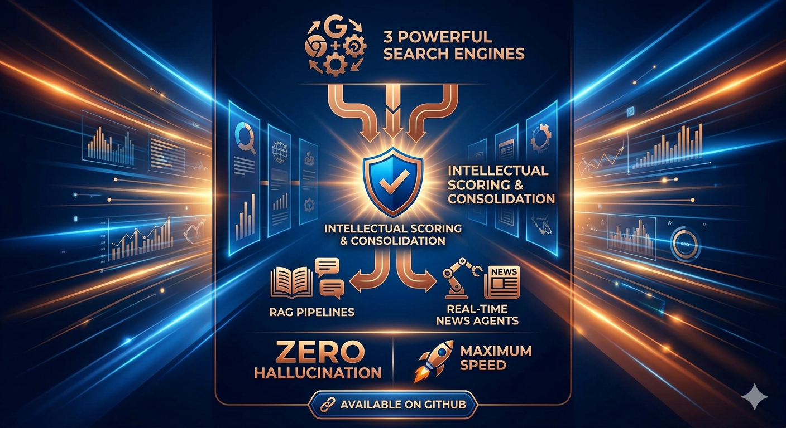
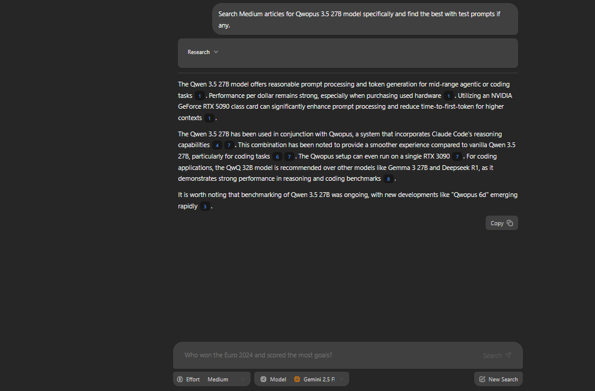

# Introducing News Agent: Three Powerful Search Engines, One Final Answer ⚡

News Agent is a high-performance search agent that orchestrates multiple search engines to deliver one final answer. It intelligently scores, consolidates, and synthesizes information similar to "AI Overviews" designed for maximum speed and zero hallucination. You can plug this agent into:
- RAG Retrieval Pipelines to get accurate summarized information
- Real world agents that need fast accurate information about products and real time news



---

## 🚀 Key Enhancements (v2.0)

| Feature | Enhancement | Benefit |
|---|---|---|
| **Ultra-Fast Search** | Removed obstacles that slow down. Optimized for Brightdata, Tavily, and DuckDuckGo. | **5x faster** search execution. |
| **Snippet Synthesis** | Replaced full-page scraping with high-quality snippet analysis. | Instant answers without scraper hangups. |
| **Parallel Execution** | Multi-query generation with simultaneous engine calls. | Comprehensive news and information in a single "call" to this API. |
| **Pure Synthesis** | Single final synthesis pass instead of looping summaries. | Highly accurate, cited answers with very little or zero hallucination. |

---

## 📸 Interface Preview



---

## ✨ Core Features

*   **Smart Query Generation**: Breaks down complex topics into targeted sub-queries.
*   **Pick your LLM**: Use local models or Gemini models. If no local model is running the port you specified, it will use Gemini.
*   **Zero-Config Needed**: No need to configure anything except API keys.

---

## 🗂 Project Structure

```
Deep_Search/
├── backend/
│   └── agent/
│       ├── app.py           # FastAPI Server (listening on :2024)
│       ├── research_agent.py # Core logic: query → parallel search → synthesis
│       └── local_llm.py     # Llama-Swap & Gemini integration
├── frontend/                # Vite + React + Tailwind UI
├── main.py                  # Optimized search pipeline runner
├── scraper.py               # (Legacy/Optional) Full content extraction
└── search_engines/          # Modular engine integrations (DuckDuckGo, Tavily, Brightdata)
```

---

## 📋 Quick Start

### 1. Install Dependencies
```bash
pip install -r requirements.txt
cd frontend && npm install
```

### 2. Configure API Keys
Create a `.env` file in the project root:
```env
GEMINI_API_KEY=your_key
BRIGHTDATA_API_KEY=your_key
TAVILY_API_KEY=your_key
DUCKDUCKGO_API_KEY (LOL it doesn't need an API key!)

# Optional
LOCAL_MODEL_PORT=8080 (use 8080 if running Llama-Swap and 11434 if running Ollama)
```

### 3. Launch
```powershell
# Start Backend
python backend/agent/app.py

# Start Frontend
cd frontend
npm run dev
```
Open **`http://localhost:5173/app/`** to start searching.

---

## 📊 Engine Optimization

| Engine | Role | Why it's here |
|---|---|---|
| **Brightdata** API Key needed | Social & Video | Best for primary sources, transcripts, and viral trends. But it is slow|
| **Tavily** API Key needed | Transcripts & Research | Specialized in finding high-density information for LLMs. |
| **DuckDuckGo** No API key needed | *Direct* | No API key needed but we use it to avoid rate-limit delays. |

---

## 🛠 Advanced Usage

Each search engine can still be tested individually via CLI:
```powershell
python search_engines/brightdata.py --search "query" --max 3
python search_engines/tavily.py --search "query" --max 3
python search_engines/duckduckgo.py --search "query" --max 3
```

Raw search result URLs and scoring metrics are always exported to `search_results.tsv` for manual review.
