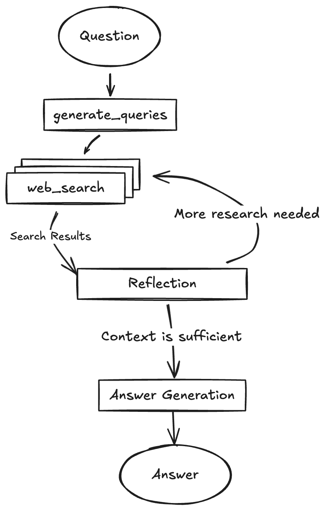

# Introducing News Agent: Three Powerful Search Engines, One Final Answer


## Overview
This is a **high-performance AI search agent** that orchestrates multiple search engines to deliver synthesized, accurate answers. Think of it as a "Google AI Overviews" engine built for developers, optimized for speed and zero hallucination.

You can plug this agent into:
- RAG Retrieval Pipelines to get accurate summarized information from the web
- Real world agents that need fast accurate information about products and news from internet
---

## Architecture

```
News_Agent/
├── Backend (Python/FastAPI)
│   ├── research_engine/ - Core AI research engine
│   │   ├── research_agent.py - Orchestrates search → synthesis pipeline
│   │   ├── local_llm.py - Llama-Swap & Gemini integration
│   │   ├── app.py - FastAPI server (port 2024)
│   │   ├── prompts.py - LLM prompt templates
│   │   └── graph.py - LangGraph state management
│   └── search_engines/ - Modular engine integrations
│       ├── brightdata.py - Social/video search
│       ├── tavily.py - Research transcripts
│       └── duckduckgo.py - Direct web search
│
├── Frontend (React/Vite/TypeScript)
│   ├── components/ - UI components
│   │   ├── InputForm.tsx - Query input
│   │   ├── ChatMessagesView.tsx - Results display
│   │   └── ActivityTimeline.tsx - Search progress
│   └── hooks/useStream.ts - WebSocket streaming
│
└── Infrastructure
    ├── Dockerfile + docker-compose.yml
    └── main.py - CLI entry point
```

---

## Key Components

| Component | Technology | Purpose |
|-----------|------------|---------|
| **Backend** | Python 3.11, FastAPI | Research orchestration, LLM integration |
| **Frontend** | React, Vite, TypeScript | Chat interface, real-time streaming |
| **LLM Layer** | Gemini API + Local (Llama-Swap/Ollama) | Query generation, synthesis |
| **Search Engines** | Brightdata, Tavily, DuckDuckGo | Multi-source information retrieval |

---

## How It Works



1. **Query Generation**: LLM breaks down user question into 3 targeted sub-queries
2. **Parallel Search**: All 3 search engines execute simultaneously on each query
3. **Snippet Synthesis**: High-quality snippets extracted (not full-page scraping for speed)
4. **Final Answer**: Single synthesis pass produces cited answer with source links

---

## Interface Preview


---

## Key Files

| File | Description |
|------|-------------|
| `backend/research_engine/research_agent.py` | Core research pipeline (query → search → answer) |
| `backend/research_engine/app.py` | FastAPI server with streaming endpoint |
| `frontend/src/App.tsx` | Main React application |
| `main.py` | CLI entry point for search pipeline |
| `docker-compose.yml` | Containerized deployment |

---

## Dependencies

**Backend:**
- `fastapi`, `uvicorn` - Web framework
- `langchain`, `langgraph` - LLM orchestration
- `google-genai` - Gemini API client
- `duckduckgo-search`, `requests` - Search engines

**Frontend:**
- `react`, `react-dom`
- `tailwindcss` - Styling
- `shadcn/ui` - Component library

---

## Quick Start

### 1. Install Dependencies
```bash
pip install -r requirements.txt
cd frontend && npm install
```

### 2. Configure API Keys
Copy the example environment file and fill in your keys:
```bash
cp .env.example .env
```
Open **`.env`** and add your credentials:
```env
GEMINI_API_KEY=your_key
BRIGHTDATA_API_KEY=your_key
TAVILY_API_KEY=your_key
```
# DuckDuckGo doesn't need an API key!

# LLM Configuration
USE_GEMINI=False  # Set to True to use Gemini API instead of local LLM
GEMINI_MODEL=gemini-2.5-flash-lite  # Gemini model to use (when USE_GEMINI=True)
LOCAL_MODEL_PORT=8080  # use 8080 if running Llama-Swap, 11434 for Ollama
LOCAL_MODEL_NAME=qwen-opus  # Local model name (ignored if USE_GEMINI=True)
LOCAL_LLM_TIMEOUT=90  # Timeout for local LLM requests in seconds
```

### 3. Launch
```bash
# Start Backend (using uv for proper dependency management)
cd backend
uv run uvicorn research_engine.app:app --host 0.0.0.0 --port 2024 --reload

# Or use the Makefile command
make dev-backend

# Start Frontend (in a separate terminal)
cd frontend
npm run dev
```
Open **`http://localhost:5173/app/`** to start searching.

---

## Engine Optimization

| Engine | Role | Why it's here |
|---|---|---|
| **Brightdata** (API Key needed) | Social & Video | Best for primary sources, transcripts, and viral trends |
| **Tavily** (API Key needed) | Transcripts & Research | Specialized in finding high-density information for LLMs |
| **DuckDuckGo** (No API key) | Direct Web | Free, no rate-limit delays |

---

## Notable Features

- ⚡ **5x faster** than traditional search via parallel execution
- 🔄 **Zero-config** - Just add API keys to `.env`
- 🎯 **Cited answers** - Every claim linked to source
- 📱 **Real-time streaming** - Watch research progress live
- 🐳 **Docker-ready** - Full containerization support

---

## Advanced Usage

Each search engine can still be tested individually via CLI:
```bash
python search_engines/brightdata.py --search "query" --max 3
python search_engines/tavily.py --search "query" --max 3
python search_engines/duckduckgo.py --search "query" --max 3
```

Raw search result URLs and scoring metrics are always exported to `search_results.tsv` for manual review.

### Output Files

After each research session, two output files are generated in the project root:

| File | Description |
|------|-------------|
| `results.txt` | Final synthesized answer with citations and source links |
| `search_results.tsv` | Raw search results from all engines (query, engine, rank, title, url, snippet) |

---

## Command Line Usage

You can use the search endpoint directly from the command line without the UI:

### Basic Search Examples

```bash
# Example 1: Who won the 2022 FIFA World Cup?
curl "http://localhost:2024/search?query=Who+won+the+World+Cup+in+2022"

# Example 2: What is the capital of France?
curl "http://localhost:2024/search?query=What+is+the+capital+of+France"

# Example 3: Latest news about artificial intelligence
curl "http://localhost:2024/search?query=Latest+news+about+artificial+intelligence"
```

### Python CLI Tool

For a richer command-line experience with progress output, use the Python CLI:

```bash
# Basic search (uses settings from .env)
python news_agent.py --query "Who won the World Cup in 2022"

# With high effort
python news_agent.py --query "Who won the World Cup in 2022" --effort high

# With a specific model
python news_agent.py --query "Who won the World Cup in 2022" --model gemini-2.5-flash-lite
```

This tool reads all configuration from `.env` and outputs a formatted response with citations.

### Advanced Options

```bash
# With effort levels
curl "http://localhost:2024/search?query=Who+won+the+World+Cup+in+2022&effort=low"
curl "http://localhost:2024/search?query=Who+won+the+World+Cup+in+2022&effort=high"

# Using a specific model
curl "http://localhost:2024/search?query=Who+won+the+World+Cup+in+2022&model=gemini-2.5-flash-lite"
```

**Parameters:**
- `query` (required): The search query
- `effort` (optional): `low`, `medium`, or `high` - affects depth of research
- `model` (optional): LLM model to use (default: `gemini-2.5-flash-lite`)

**Response:** Plain text with the synthesized answer and source citations.
